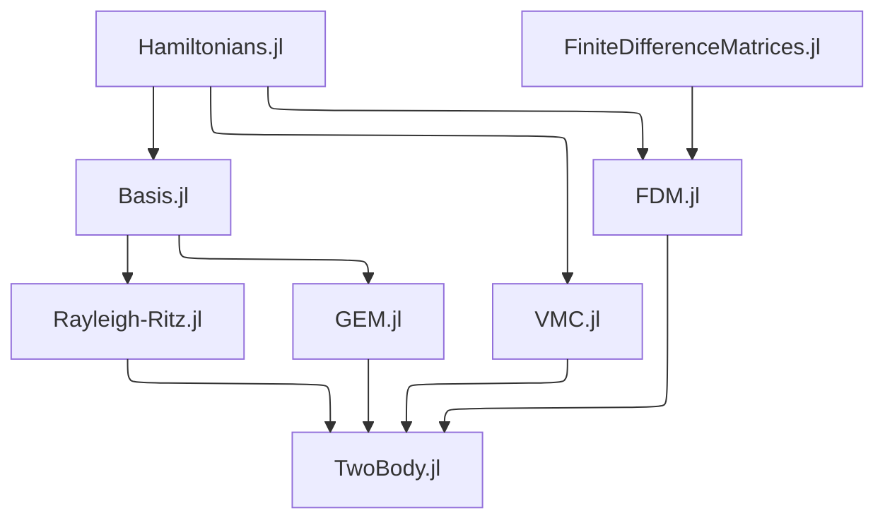

# TwoBody.jl [](https://ohno.github.io/TwoBody.jl/stable) [](https://ohno.github.io/TwoBody.jl/dev) [](https://github.com/ohno/TwoBody.jl/actions)

TwoBody.jl: a Julia package for quantum mechanical two-body problems

## Documentation 

https://ohno.github.io/TwoBody.jl/dev/

## Dependency



## Developer's Guide

There are several tools for developers.

```sh
git clone https://github.com/ohno/TwoBody.jl.git
cd TwoBody.jl
julia
julia> include("dev/revice.jl")
julia> include("dev/test.jl")
julia> include("dev/docs.jl")
```
